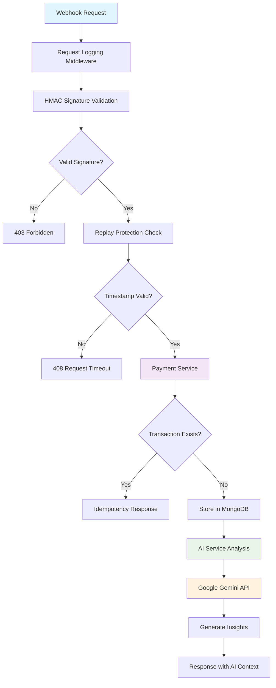

# 🛡️ Auto-Pay: Secure AI-Powered Webhook Gateway

Auto-Pay is a production-grade webhook processing system that combines hardened security with intelligent transaction analysis. It provides enterprise-grade payment webhook processing with AI-driven insights while maintaining 9.5/10 security standards through comprehensive protection against replay attacks and data breaches.

## ✨ Key Features

### 🤖 AI-Driven Analysis
- **Seamless Google Gemini Integration**: Automatic transaction context analysis and business intelligence generation
- **Smart Anomaly Detection**: AI-powered identification of unusual payment patterns and potential fraud
- **Automated Reporting**: Generate comprehensive business reports from transaction data with natural language summaries

### 🔒 Hardened Security
- **HMAC SHA-256 Signatures**: Cryptographic verification ensures webhook authenticity and prevents tampering
- **Replay Protection**: Timestamp binding prevents request replay attacks with configurable webhook age limits
- **PII Masking**: Automatic sanitization of sensitive data in logs and monitoring outputs
- **Rate Limiting**: Built-in protection against brute force and DoS attacks

### 🏗️ Clean Architecture
- **Decoupled Service Layer**: Separation of concerns with dedicated payment, AI, and security services
- **Pydantic v2 Response Schemas**: Type-safe data validation and serialization with comprehensive error handling
- **Async/Await Throughout**: Non-blocking I/O for high-throughput payment processing
- **Middleware Pattern**: Modular request logging and security validation

### 📊 Cloud-Native Observability
- **Structured JSON Logging**: Consistent log format ready for ELK stack integration
- **Grafana-Compatible Metrics**: Built-in monitoring endpoints with API key authentication
- **Error Tracking**: Comprehensive error monitoring with stack traces and context
- **Health Checks**: Production-ready health endpoints for load balancer integration

## 🏛️ Architecture



## 🛠️ Tech Stack

- **Framework**: FastAPI with async/await support
- **Database**: MongoDB with Beanie ODM for async document operations
- **AI Integration**: Google Generative AI SDK (Gemini models)
- **Data Validation**: Pydantic v2 with strict type checking
- **Security**: HMAC SHA-256 with constant-time comparison
- **Resilience**: Tenacity for retry logic and fault tolerance
- **Rate Limiting**: SlowAPI for distributed rate limiting
- **Testing**: Pytest with 90%+ coverage and professional fixtures

## � Quick Start

### Prerequisites
- Python 3.11+
- MongoDB 5.0+
- Google Gemini API key

### Installation

1. **Clone the repository**
   ```bash
   git clone <repository-url>
   cd Auto-Pay
   ```

2. **Create virtual environment**
   ```bash
   python -m venv venv
   source venv/bin/activate  # On Windows: venv\Scripts\activate
   ```

3. **Install dependencies**
   ```bash
   pip install -r requirements.txt
   ```

4. **Configure environment**
   ```bash
   cp env.example .env
   # Edit .env with your configuration
   ```

### Environment Configuration

Create a `.env` file with the following variables:

```env
# Database
MONGO_URL="mongodb://localhost:27017/payments_db"

# Security
HMAC_SECRET_KEY="your-cryptographically-secure-secret-key-here"

# AI Integration
GEMINI_API_KEY="your-gemini-api-key-from-google-cloud"

# Monitoring (Optional but recommended)
MONITORING_API_KEY="your-secure-monitoring-api-key"

# Security Settings
MAX_WEBHOOK_AGE_SECONDS=300  # 5 minutes default
```

### Running the Application

**Development Mode:**
```bash
uvicorn app.main:app --reload
```

**Production Mode:**
```bash
uvicorn app.main:app --host 0.0.0.0 --port 8000 --workers 4
```

**Using Taskipy (recommended):**
```bash
task dev    # Development with linting
task test   # Run test suite
task mock   # Run webhook simulator
task report # Generate AI reports
```

## 🔐 Security Highlights

### Request Replay Protection

Auto-Pay implements sophisticated replay attack prevention:

1. **Timestamp Validation**: Every webhook must include a `timestamp` field
2. **Age Verification**: Requests older than `MAX_WEBHOOK_AGE_SECONDS` are rejected
3. **Idempotency Guarantee**: Duplicate `tx_id` values are detected and handled gracefully
4. **HMAC Binding**: Timestamps are included in HMAC signature calculation

```python
# Example webhook payload with replay protection
{
    "tx_id": "unique-transaction-id",
    "amount": 99.99,
    "currency": "USD",
    "timestamp": 1640995200,  # Unix timestamp
    "signature": "hmac-sha256-signature"
}
```

### Log Sanitization

All sensitive data is automatically masked in logs:

- **PII Detection**: Automatic identification of email addresses, phone numbers, and credit card numbers
- **HMAC Secrets**: Never logged or exposed in error messages
- **API Keys**: Removed from all monitoring and debugging outputs
- **Transaction Data**: Sensitive fields are replaced with placeholders in logs

## 🧪 Testing

The project maintains 90%+ test coverage with professional pytest fixtures:

### Test Structure
- **Unit Tests** (`test_unit.py`): Isolated business logic testing with autospecced mocks
- **Integration Tests** (`test_integration.py`): End-to-end workflow validation
- **AI Service Tests** (`test_ai_service.py`): AI integration testing with mocked responses

### Running Tests
```bash
# Run all tests
pytest

# Run with coverage
pytest --cov=app --cov-report=html

# Run specific test file
pytest tests/test_unit.py
```

### Test Features
- **Autospecced Mocks**: Production-ready mock validation
- **Async Testing**: Proper async/await test patterns
- **Security Testing**: HMAC signature validation and replay attack scenarios
- **Error Scenarios**: Database failures, timeouts, and network issues

## 📡 API Endpoints

### Webhook Processing
- `POST /webhooks/payments` - Process payment webhooks with AI analysis

### Monitoring (API Key Required)
- `GET /monitoring/health` - Application health status
- `GET /monitoring/errors` - Error summary and recent incidents
- `GET /monitoring/metrics` - Application performance metrics

### Administration
- `GET /docs` - Interactive API documentation (Swagger UI)
- `GET /redoc` - Alternative API documentation

## 🔧 Development

### Code Quality
```bash
task lint  # Run ruff for linting and formatting
```

### Mock Data Generation
```bash
task mock  # Simulate webhook traffic for testing
```

### AI Report Generation
```bash
task report  # Generate AI-powered business reports
```

## 📈 Monitoring & Observability

### Structured Logging
All logs are emitted in structured JSON format:
```json
{
  "timestamp": "2024-01-01T12:00:00Z",
  "level": "INFO",
  "message": "Webhook processed successfully",
  "tx_id": "masked-transaction-id",
  "processing_time_ms": 45,
  "ai_analysis_completed": true
}
```

### Health Checks
- **Database Connectivity**: MongoDB connection status
- **AI Service**: Gemini API availability
- **Error Rates**: Recent error statistics
- **Performance**: Request processing times

## 🤝 Contributing

1. Fork the repository
2. Create a feature branch
3. Add tests for new functionality
4. Ensure all tests pass
5. Submit a pull request with comprehensive description

## 📄 License

This project is licensed under the MIT License - see the LICENSE file for details.

## 🆘 Support

For security issues, please email security@auto-pay.com
For general support, please create an issue in the repository

---

**Auto-Pay**: Where security meets intelligence in payment processing.